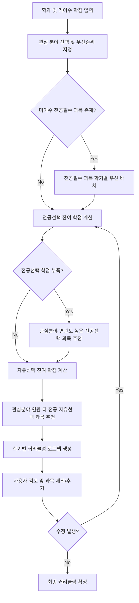
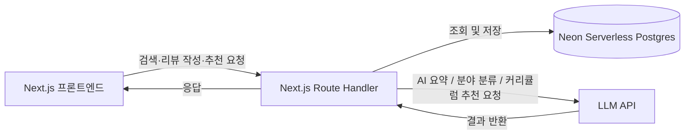

# 수강길잡이 PRD

**목차**

1. 문서 정보
2. 개요
3. 배경 및 문제 정의
4. 목표
5. 타겟 사용자
6. 기존 서비스 대비 차별점
7. 핵심 기능 요약
8. 상세 기능 명세 (F1~F4)
9. 데이터 요구사항
10. 기술 스택 및 아키텍처
11. 우선순위 및 릴리즈 로드맵
12. 리스크 및 고려사항

---

## 1. 문서 정보

| 항목        | 내용                                     |
| ----------- | ---------------------------------------- |
| 문서명      | 수강길잡이 Product Requirements Document |
| 버전        | v1.1                                     |
| 작성일      | 2026-07-28                               |
| 최종 수정일 | 2026-07-28 (기술 스택 섹션 추가)         |
| 상태        | Draft — 검토 및 피드백 필요              |
| 서비스명    | 수강길잡이 (가칭, 추후 변경 가능)        |
| 대상 독자   | 기획·디자인·개발 담당자, 이해관계자      |

---

## 2. 개요 (Executive Summary)

**수강길잡이**는 대학생이 수강 과목을 탐색하고, 진로에 맞는 커리큘럼을 설계하는 과정을 돕는 AI 기반 수강 도우미 서비스입니다.

현재 대학생들은 에브리타임과 같은 커뮤니티 서비스에서 수강평을 확인하지만, ① 리뷰가 텍스트로만 나열되어 있어 종합적으로 파악하기 어렵고, ② 과목명에 검색어가 정확히 포함되어야만 검색이 가능하며, ③ 관심 진로 분야(예: 반도체)와 관련된 과목을 통합적으로 찾을 방법이 없고, ④ 전공 학점 요건을 채우면서 진로에 맞는 커리큘럼을 설계해주는 도구가 없다는 한계가 있습니다.

수강길잡이는 이 네 가지 문제에 대응하는 다음 핵심 기능을 제공합니다.

1. 수강평 해시태그화 및 AI 요약
2. 키워드 + 분야(카테고리) 통합 검색
3. 산업/진로 분야 키워드 기반 과목 검색
4. 학과 + 관심 분야 기반 AI 맞춤 커리큘럼 설계

---

## 3. 배경 및 문제 정의

### 3.1 현황

대학생 대부분은 수강신청 전 에브리타임 등에서 이전 수강생들의 수강평을 참고합니다. 그러나 이 과정은 과목당 많게는 수백 개에 달하는 비정형 텍스트 리뷰를 학생이 직접 읽고 판단해야 하는 구조이며, 검색 역시 정확한 과목명 매칭에 의존하고 있어 탐색 효율이 낮습니다.

### 3.2 Pain Points

| #   | 문제                              | 상세                                                                                                                                          |
| --- | --------------------------------- | --------------------------------------------------------------------------------------------------------------------------------------------- |
| P1  | 정보 과부하                       | 과목당 수십~수백 개의 리뷰가 텍스트로만 나열되어, 강의의 전반적 특징을 파악하려면 학생이 직접 다 읽고 종합해야 함                             |
| P2  | 키워드 매칭 한계                  | "수학"으로 검색하면 과목명에 "수학"이 포함된 과목만 노출되고, 미적분학·선형대수학처럼 수학 분야에 속하지만 이름에 "수학"이 없는 과목은 누락됨 |
| P3  | 정확한 과목명 의존 검색           | 관심 분야(예: 반도체)의 과목을 찾고 싶어도 정확한 과목명을 모르면 검색이 불가능하고, 여러 학과에 흩어진 관련 과목을 학생이 직접 찾아야 함     |
| P4  | 진로 기반 커리큘럼 설계 기능 부재 | 전공 학점 요건을 채우면서 희망 진로에 맞는 과목을 전략적으로 선택하는 기능이 없어, 전적으로 학생 개인의 정보력에 의존함                       |

---

## 4. 목표

### 4.1 비즈니스/제품 목표

- 대학생의 수강 의사결정에 드는 시간과 불확실성을 줄인다.
- 수강평 작성-열람의 선순환 구조를 만들어 지속적으로 리뷰 데이터를 축적한다.
- 향후 다수 대학·학과로 확장 가능한 과목-분야-커리큘럼 데이터 구조를 구축한다.

### 4.2 사용자 목표

- 리뷰를 일일이 읽지 않아도 과목의 특징을 빠르게 파악하고 싶다.
- 정확한 과목명을 몰라도 관심 키워드·분야로 관련 과목을 찾고 싶다.
- 진로에 맞춰 앞으로 몇 학기 동안 무엇을 들어야 하는지 계획을 세우고 싶다.

### 4.3 Non-goals (본 PRD 범위 밖)

- 실제 수강신청(등록) 자체를 대체하지 않음 (각 학교 수강신청 시스템 안내에 그침)
- 성적 관리, 학적 조회 등 학사 행정 기능은 다루지 않음
- 학교별 세부 데이터 연동 방식(API 연동 방식 등)은 별도 기술 문서에서 다룸

---

## 5. 타겟 사용자

### 5.1 페르소나 A — 저학년 탐색형 (1~2학년)

전공/진로가 아직 뚜렷하지 않아 다양한 분야의 과목을 폭넓게 탐색하고 싶어하며, "널널한 강의인지", "팀플이 많은지" 등 실질적인 강의 특성을 빠르게 확인하고 싶어 함.

### 5.2 페르소나 B — 진로 설계형 (3~4학년)

희망 진로(반도체, 데이터사이언스, 금융 등)가 어느 정도 정해져 있으며, 전공 학점 요건을 채우면서 남은 학기를 어떻게 구성할지 계획하고 싶어 함.

### 5.3 페르소나 C — 리뷰 기여형

수강 후 후배에게 도움이 되는 정보를 남기고 싶어하며, 본인이 남긴 리뷰가 다른 학생에게 잘 요약되어 전달되기를 바람.

---

## 6. 기존 서비스 대비 차별점

| 구분                  | 에브리타임 등 기존 서비스                 | 수강길잡이                                           |
| --------------------- | ----------------------------------------- | ---------------------------------------------------- |
| 수강평 확인 방식      | 텍스트 리스트 나열, 전체를 직접 읽어야 함 | 해시태그 + AI 요약으로 핵심을 한눈에 파악            |
| 분야 기반 검색        | 과목명에 검색어가 포함된 경우만 노출      | 과목명 매칭과 분야(카테고리) 매칭을 함께 제공        |
| 진로/산업 키워드 검색 | 미지원, 정확한 과목명이 있어야 검색 가능  | "반도체" 등 산업 분야 키워드로 관련 과목 리스트 제공 |
| 커리큘럼 설계         | 미지원                                    | 학과 + 관심 분야 기반 AI 맞춤 커리큘럼 추천          |

---

## 7. 핵심 기능 요약

| ID  | 기능명                     | 설명                                                             | 우선순위 |
| --- | -------------------------- | ---------------------------------------------------------------- | -------- |
| F1  | 수강평 해시태그 & AI 요약  | 수강평 등록 시 해시태그 부여, AI가 전체 리뷰를 종합 요약         | P0       |
| F2  | 분야 통합 검색             | 키워드 검색 시 과목명 매칭 + 분야(학문 카테고리) 매칭 동시 제공  | P0       |
| F3  | 산업/진로 분야 키워드 검색 | "반도체" 등 산업·진로 분야 키워드로 관련 과목 리스트업           | P1       |
| F4  | AI 맞춤 커리큘럼 설계      | 학과 + 관심 분야 선택 시 학점 요건을 반영한 학기별 커리큘럼 추천 | P1       |

> P0: MVP 필수 기능 / P1: 2차 우선순위 기능

---

## 8. 상세 기능 명세

### 8.1 F1. 수강평 해시태그 & AI 요약

**배경**
수강평은 존재하지만 리뷰 수가 많아질수록 학생이 직접 종합 판단하기 어려워짐.

**사용자 스토리**

- 학생으로서, 관심 과목에 달린 수십 개의 수강평을 다 읽지 않고도 강의 특징을 빠르게 알고 싶다.
- 리뷰 작성자로서, 내 리뷰의 핵심이 다른 학생에게 잘 전달되도록 태그로 표시하고 싶다.

**기능 요구사항**

1. 수강평 작성 시 별점(5점 만점)과 자유 텍스트, 사전 정의된 해시태그(다중 선택)를 함께 입력할 수 있다. (예: #꿀강의, #널널함, #과제많음, #팀플많음, #출석중요, #시험어려움, #교수님친절, #실무중심, #재수강비추)
2. 사용자가 작성한 자유 텍스트를 바탕으로 AI가 해시태그 후보를 추천하고, 사용자가 채택·수정할 수 있다.
3. 과목별로 누적된 전체 수강평을 AI가 3~5문장 내외로 요약한다. 요약에는 전반적 평가 경향, 대표적 장점·단점, 추천 대상을 포함한다.
4. 리뷰가 최소 기준(예: 5개) 미만인 과목은 "리뷰가 아직 충분하지 않습니다"로 안내하고 요약을 제한적으로 제공하거나 생략한다.
5. 신규 리뷰가 일정 수 누적되면 AI 요약을 자동으로 재생성한다.
6. 과목 상세 페이지에 해시태그별 언급 빈도(%)를 시각적으로 표시한다.
7. 동일 사용자의 반복·도배성 리뷰, 극단적 평점 테러 등을 탐지·필터링하는 로직을 둔다.

**예시**

> "미적분학1 (홍길동 교수)" 과목 요약 — "과제와 퀴즈가 잦아 꾸준한 학습이 필요하지만, 개념 설명이 명확하다는 평가가 많습니다. 상대평가가 엄격한 편으로 학점이 급한 학생보다는 기초를 탄탄히 다지고 싶은 학생에게 적합합니다." (#과제많음 72% · #설명잘함 65% · #학점짜게줌 58%)

**Edge Case**

- 리뷰가 극단적으로 상반되는 경우 → 요약에 "호불호가 갈리는 강의"임을 명시
- 신규 개설 과목으로 리뷰가 전혀 없는 경우 → "첫 수강평을 남겨보세요" 안내

**완료 조건**

- [ ] 수강평 작성 시 해시태그 다중 선택 및 AI 추천 태그 기능이 동작한다
- [ ] 리뷰 5개 이상 과목에서 AI 요약이 생성되어 노출된다
- [ ] 해시태그별 언급 빈도가 과목 상세 페이지에 표시된다
- [ ] 신규 리뷰 등록 시 요약이 갱신된다

### 8.2 F2. 분야 통합 검색

**배경**
"수학"을 검색했을 때 과목명에 "수학"이 포함된 과목만 노출되고, 분야상 수학에 속하는 과목(미적분학, 선형대수학 등)은 누락되는 문제.

**사용자 스토리**

- 학생으로서, "수학"을 검색했을 때 과목명에 수학이 들어간 과목뿐 아니라 수학 분야에 속하는 모든 과목을 함께 보고 싶다.

**기능 요구사항**

1. 모든 과목에 하나 이상의 학문 분야(카테고리) 태그를 부여한다. (예: 미적분학 → [수학], 일반물리학 → [물리학])
2. 분야 분류 체계(대분류-소분류)를 정의한다. (예: 자연과학 > 수학 > 해석학/대수학/통계학 등)
3. 초기 분야 태깅은 과목명·강의계획서를 기반으로 AI가 1차 분류하고, 담당자가 검수해 확정한다.
4. 검색 시 (a) 과목명·설명에 검색어가 포함된 결과와 (b) 검색어와 일치·유사한 분야에 속한 과목 결과를 함께 제공하며, 두 결과를 구분해 보여준다. (예: "과목명 일치" 섹션과 "분야: 수학" 섹션)
5. 검색 결과는 학점, 학년, 개설 학과, 평점, 리뷰 수 등으로 필터링·정렬할 수 있다.
6. 분야명 동의어(예: "수학" ↔ "수리과학")를 인식할 수 있도록 동의어 사전을 관리한다.
7. 하나의 과목이 복수 분야에 속할 수 있다. (예: "데이터구조"는 [컴퓨터공학]이자 [수학]적 성격도 태깅 가능)

**예시**

> "수학" 검색 → [과목명 일치] 수학의 이해, 수학교육론 / [분야: 수학] 미적분학1, 선형대수학, 확률과 통계

**Edge Case**

- 여러 분야에 걸친 과목의 태깅 우선순위 처리 필요
- 신설 분야(예: 데이터사이언스가 별도 분야로 독립하는 경우) 등 분류 체계 개정 프로세스 필요

**완료 조건**

- [ ] 검색어가 과목명에 포함된 결과와 분야가 일치하는 결과가 모두 노출된다
- [ ] 두 결과 유형이 구분되어 표시된다
- [ ] 필터·정렬 옵션이 정상 동작한다

### 8.3 F3. 산업/진로 분야 키워드 검색

**배경**
F2가 학문적 분야(수학, 물리학 등) 중심이라면, "반도체"처럼 특정 학과에 국한되지 않고 여러 학과에 흩어진 산업/진로 분야는 별도의 태깅 축이 필요함.

**사용자 스토리**

- 반도체 산업 취업을 희망하는 학생으로서, 학과와 무관하게 반도체와 관련된 모든 과목을 한 번에 찾고 싶다.

**기능 요구사항**

1. 학문 분야(F2)와는 별도로 "산업/진로 분야" 태그셋을 정의한다. (예: 반도체, AI·데이터사이언스, 바이오·헬스케어, 금융·핀테크, 콘텐츠·미디어 등)
2. 하나의 과목이 여러 산업 분야에 매핑될 수 있다. (예: "반도체공정개론"은 [반도체]이자 학문 분야로는 [화학공학])
3. 과목의 강의계획서·키워드를 기반으로 AI가 산업 분야와의 연관도를 스코어링하고, 담당자 검수를 거쳐 태그를 확정한다.
4. 검색 결과는 연관도 순으로 정렬하며, 개설 학과·학점·이수구분(전필/전선/교양)을 함께 표시한다.
5. 사용자의 소속 학과를 기준으로 "내 전공에서 바로 들을 수 있는 과목"과 "타 전공 과목(수강 가능 여부 별도 확인 필요)"을 구분해 표시한다.
6. 신조어·신산업 분야(예: 생성형 AI) 등장 시 태그 체계를 유연하게 확장할 수 있는 운영 프로세스를 둔다.

**예시**

> "반도체" 검색 → 반도체공정개론(화학공학과), 반도체소자(전자공학과), 신소재공학개론(신소재공학과) 등 연관도 순 리스트

**Edge Case**

- 타 전공 과목은 정원·선수과목·학년 제한이 있을 수 있음을 명시해야 함

**완료 조건**

- [ ] 산업/진로 분야 키워드 검색 시 여러 학과에 걸친 관련 과목이 연관도 순으로 노출된다
- [ ] 각 결과에 개설 학과, 학점, 이수구분이 표시된다
- [ ] 내 전공 과목과 타 전공 과목이 구분 표시된다

### 8.4 F4. AI 맞춤 커리큘럼 설계

**배경**
전공 학점 요건 충족과 희망 진로에 맞는 과목 선택을 동시에 고려해주는 도구가 없어, 학생이 전적으로 개인 정보력에 의존해 커리큘럼을 짜야 함. 4개 기능 중 복잡도가 가장 높은 기능.

**사용자 스토리**

- 반도체 산업 취업을 목표로 하는 전자공학과 학생으로서, 전공 필수·선택 학점을 채우는 동시에 반도체 관련 과목 위주로 남은 학기 커리큘럼을 자동으로 추천받고 싶다.

**기능 요구사항**

_입력_

1. 사용자는 본인 학과(복수전공·부전공 포함 가능)를 선택한다.
2. 현재 학년/학기와 기이수 과목·학점을 입력한다. (추후 성적표 업로드 연동은 확장 과제로 고려)
3. 관심 분야(F3의 산업 분야 태그 또는 자유 입력)를 1개 이상 선택하고 우선순위를 지정할 수 있다.
4. 졸업까지 남은 학기 수를 입력한다.

_기반 데이터_ 5. 학과별 졸업 요건 데이터(전공필수 과목·학점, 전공선택 최소 이수 학점, 교양 요건, 총 이수 학점, 선수과목 관계)를 확보·관리한다.

- 더미 데이터 인서트해서 할 수 있도록 추가

_추천 로직_ 6. 1단계: 미이수 전공필수 과목을 선수과목 순서를 고려해 학기별로 우선 배치한다. 7. 2단계: 전공선택 학점 요건 중 남은 학점을 계산한다. 8. 3단계: 전공선택 잔여 학점과 자유선택·교양 학점에는 관심 분야와 연관도가 높은 과목을 우선 추천한다. 본인 전공 내 과목을 우선하되, 부족할 경우 타 전공 과목도 추천하며 수강 가능 여부와 제약사항을 함께 표시한다. 9. 학기별 권장 학점(예: 15~18학점)을 고려해 여러 학기에 걸친 로드맵 형태로 결과를 구성한다. 10. 시간표 충돌(요일·시간 겹침)은 MVP 범위에서 제외하며, 향후 실제 개설 시간표 데이터 확보 시 반영 가능한 확장 과제로 명시한다.

_결과 및 상호작용_ 11. 학기별 추천 과목 리스트를 전공필수/전공선택/관심분야 과목으로 구분해 제공하고, 각 과목에 추천 사유를 함께 표시한다. (예: "반도체 분야 연관도가 높고 전공선택 학점으로 인정됩니다") 12. 사용자가 추천 과목을 제외·추가하면 나머지 추천 결과가 재계산되는 인터랙티브 구조로 제공한다. 13. 학과 커리큘럼은 연도별로 개정될 수 있으므로 버전 관리 체계를 둔다.

**F4 추천 로직 플로우**

**Edge Case**

- 복수전공·부전공 사용자는 2개 이상 학과 요건을 동시에 반영해야 함
- 대부분의 학점을 이미 이수한 고학년 사용자는 추천 여지가 적을 수 있어, 이 경우에 맞는 안내 문구가 필요함
- 관심 분야 관련 과목이 본인 학과·수강 가능 범위 내에 부족하면 계절학기·교양 과목까지 탐색 범위를 확장함

**완료 조건**

- [ ] 학과·기이수학점·관심분야 입력 후 학기별 추천 커리큘럼이 생성된다
- [ ] 전공필수 미이수 과목이 우선적으로 배치된다
- [ ] 추천 과목마다 추천 사유가 함께 표시된다
- [ ] 사용자가 과목을 제외/추가하면 추천이 재계산된다
- [ ] 본 추천은 "참고용"이며 최종 확인은 학과 사무실을 통해야 함을 안내하는 문구가 노출된다

---

## 9. 데이터 요구사항 (핵심 엔티티)

| 엔티티                        | 주요 속성                                                                                  | 비고                       |
| ----------------------------- | ------------------------------------------------------------------------------------------ | -------------------------- |
| 과목 (Course)                 | 과목코드, 과목명, 개설학과, 학점, 이수구분(전필/전선/교양), 강의계획서, 선수과목, 개설학기 | 학교 공식 데이터 연동 필요 |
| 학문분야 태그 (Field Tag)     | 태그명, 상위분류, 연결된 과목 목록                                                         | F2 관련                    |
| 산업/진로 태그 (Industry Tag) | 태그명, 연결된 과목 목록, 연관도 스코어                                                    | F3 관련                    |
| 수강평 (Review)               | 과목ID, 작성자(익명 처리), 평점, 본문, 해시태그, 작성 학기·연도                            | 어뷰징 방지 로직 필요      |
| AI 요약 (Summary)             | 과목ID, 요약 본문, 생성일시, 기반 리뷰 수                                                  | 리뷰 누적 시 재생성        |
| 사용자 (User)                 | 익명 식별자, 학과(복수전공 포함), 학년, 관심 분야, 기이수 과목 목록                        | 개인정보 최소 수집 원칙    |
| 학과 커리큘럼 (Curriculum)    | 학과, 적용 입학년도, 전공필수 목록, 전공선택 최소학점, 졸업요건                            | 연도별 버전 관리 필요      |

---

## 10. 기술 스택 및 아키텍처

### 10.1 기술 스택 개요

| 영역         | 선택 기술                  | 비고                                                                                              |
| ------------ | -------------------------- | ------------------------------------------------------------------------------------------------- |
| 프레임워크   | Next.js (App Router)       | 프론트엔드 렌더링과 백엔드 로직(Route Handler)을 하나의 코드베이스에서 처리하는 풀스택 프레임워크 |
| 데이터베이스 | Neon (Serverless Postgres) | 서버리스 오토스케일링, 브랜칭, pgvector 확장 지원                                                 |
| 배포/호스팅  | Vercel                     | Next.js와 동일 벤더가 운영하는 배포 플랫폼, 서버리스·엣지 함수 및 프리뷰 배포 제공                |

### 10.2 아키텍처 개요

수강길잡이는 Next.js 단일 코드베이스로 프론트엔드와 백엔드(Route Handler/Server Action)를 함께 구성하고, Vercel에 배포하며, 데이터는 Neon Postgres에 저장하는 구조를 기본으로 한다. 수강평 요약(F1), 분야 연관도 분석(F3), 커리큘럼 추천(F4)과 같은 AI 기능은 서버 사이드에서 외부 LLM API를 호출하는 방식으로 구현한다.

### 10.3 기능별 기술 구현 방향

| 기능                     | 구현 방향                                                                                                                                                                            |
| ------------------------ | ------------------------------------------------------------------------------------------------------------------------------------------------------------------------------------ |
| F1 (해시태그 & AI 요약)  | 리뷰는 Route Handler를 통해 Neon에 저장하고, 신규 리뷰가 누적되면 LLM API로 요약 생성을 요청한 뒤 결과를 별도 테이블에 캐싱해 조회 시마다 재생성하지 않도록 한다                     |
| F2 (분야 통합 검색)      | 과목명 검색은 Postgres 텍스트 검색으로, 분야 매칭은 과목-분야 태그 테이블 조인으로 우선 구현하고, 향후 Neon의 pgvector 확장을 활용한 임베딩 기반 유사도 매칭으로 고도화한다          |
| F3 (산업/진로 분야 검색) | 과목 설명과 산업 분야 키워드를 임베딩으로 변환해 pgvector 유사도 검색으로 연관도를 계산한다                                                                                          |
| F4 (AI 커리큘럼 설계)    | 전공필수·전공선택 학점 계산은 Route Handler 내 로직으로 처리하고, 관심분야 매칭 추천 부분만 LLM API에 위임한다. 연산 시간이 길어질 경우 스트리밍 응답 또는 상태 폴링 구조를 검토한다 |

### 10.4 기술 스택 관련 고려사항

- **서버리스 실행 특성**: Vercel 서버리스·엣지 함수는 실행 시간과 페이로드 크기에 제약이 있으므로, F4처럼 연산이 무거운 기능은 응답을 스트리밍하거나 결과를 비동기로 생성한 뒤 폴링하는 구조를 검토한다.
- **DB 커넥션 관리**: 서버리스 함수는 요청마다 새 연결을 맺는 경우가 많으므로, Neon의 서버리스 드라이버 또는 커넥션 풀링을 활용해 연결 오버헤드를 관리한다.
- **콜드 스타트 대응**: Neon은 비활성 상태에서 컴퓨트가 절전(scale-to-zero)되므로 첫 요청의 응답 지연이 발생할 수 있다. 트래픽이 많은 시간대에는 최소 컴퓨트 유지 옵션을 검토한다.
- **프리뷰 환경 활용**: Vercel 프리뷰 배포와 Neon 브랜칭을 연동하면 기능 단위 배포마다 격리된 DB 브랜치가 자동 생성되어, 배포 전 분야 태깅·커리큘럼 로직 변경을 안전하게 검증할 수 있다.
- **ORM 및 LLM API 벤더**: 구체적인 ORM(예: Prisma, Drizzle)과 AI 기능에 사용할 LLM API 벤더는 아직 정해지지 않아 14장 오픈 이슈에서 별도 관리한다.

---

## 11. 우선순위 및 릴리즈 로드맵 (제안)

| Phase         | 범위   | 핵심 목표                                             |
| ------------- | ------ | ----------------------------------------------------- |
| Phase 1 (MVP) | F1, F2 | 핵심 리뷰·검색 경험 검증, 초기 리뷰 데이터 확보       |
| Phase 2       | F3     | 진로 탐색 니즈 충족, 산업분야-과목 매핑 데이터 고도화 |
| Phase 3       | F4     | 커리큘럼·졸업요건 데이터 확보 후 고관여 기능 출시     |

F4는 학과별 커리큘럼 데이터 확보가 선행되어야 하므로, 데이터 파트너십(교무처·학과 사무실) 또는 사용자 직접 입력 기반의 임시 대안을 별도로 검토할 필요가 있다.

---

## 12. 리스크 및 고려사항

| 리스크                 | 내용                                                                                                           | 고려 방향                                                      |
| ---------------------- | -------------------------------------------------------------------------------------------------------------- | -------------------------------------------------------------- |
| 커리큘럼 데이터 확보   | 학교별 공식 졸업요건 데이터를 확보하지 못하면 F4 정확도가 떨어짐                                               | 학교 협의 또는 사용자 입력·크라우드소싱 병행                   |
| 콜드스타트             | 초기 리뷰 부족 시 F1 요약 품질 저하                                                                            | 특정 대학·학과부터 리뷰 데이터 집중 확보                       |
| AI 정확성·편향         | 극단적 리뷰가 요약을 왜곡하거나, 커리큘럼 추천 오류가 졸업에 실질적 영향을 줄 수 있음                          | F4는 "참고용"임을 명시하고 최종 확인은 학과 사무실을 통해 안내 |
| 서버리스 아키텍처 제약 | Vercel 서버리스·엣지 함수의 실행시간·페이로드 제약으로 F4처럼 연산이 무거운 기능에서 타임아웃이 발생할 수 있음 | 스트리밍 응답, 비동기 처리 후 폴링, 별도 작업 큐 도입 검토     |
| 기존 커뮤니티와의 경쟁 | 에브리타임 등 기존 습관 전환에 진입장벽 존재                                                                   | 리뷰 데이터·큐레이션 품질 차별화로 대응                        |
| 데이터 출처·저작권     | 강의계획서, 커리큘럼 등 학교 제공 자료 활용 범위에 대한 검토 필요                                              | 학교와의 데이터 이용 협의 사전 진행                            |

---
